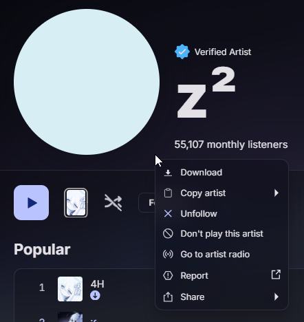

# SpotifyDL

A rudimentary Spotify Downloader based on Librespot.

## Features
- Download tracks from Spotify in OGG 320kbps with metadata.
- Adds a direct download option to the Spotify desktop client (via Spicetify).

## Usage
### Setup

Requirements: Python 3.10 or newer, Spotify Premium, a [Spotify app](https://developer.spotify.com/dashboard) for API calls.
- Copy the repo and install the dependencies (use a venv as needed). 
```bash
pip install -r requirements.txt
```
- Run `.main.py` and follow the instructions.
```bash
python main.py
```
If you struggle to generate the `credentials.json` file (eg. you are running the script on a server), run the script locally, connect to the "librespot" device from a Spotify client on the same computer, then export the file to the root folder of SpotifyDL.  

Supported query: song title, Spotify URL (track, album or **public** playlist).

### Spicetify integration

<p align="center">
    
</p>

Requirements: Spotify client, [Spicetify](https://spicetify.app/).
- Install the dependencies to run `spicetify_server.py` (Flask server, use a venv as needed). 
```bash
pip install -r spicy_requirements.txt
```
- Locate the Spicetify `Extensions` folder:
```bash
spicetify config-dir
```
- Copy or move `spotifyDL.js` into the `Extensions` folder.
- Enable the extension:
```bash
spicetify config extensions spotifyDL.js
spicetify apply
```
- Run `spicetify_server.py`
```bash
python spicetify_server.py
```

> [!TIP]  
> You may want to create a script to run the server more easily. For example on Windows:
> ```bash
> # In SpotifyDL.bat
> cd /path/to/SpotifyDL
> ".venv/Scripts/python.exe" spicetify_server.py
> ```

## Config
You can change the following in the `config.py` file:
- Track folder
- Reveal songs in file explorer after download
- Try FLAC files download (will probably not work)

## To do
- Add FLAC support